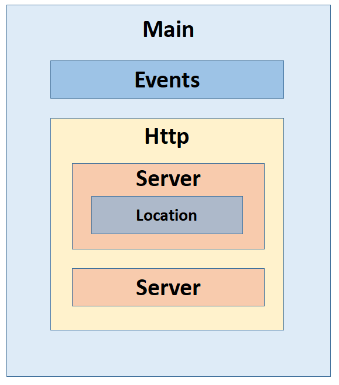
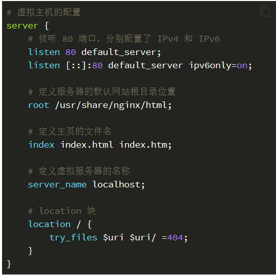
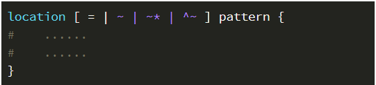
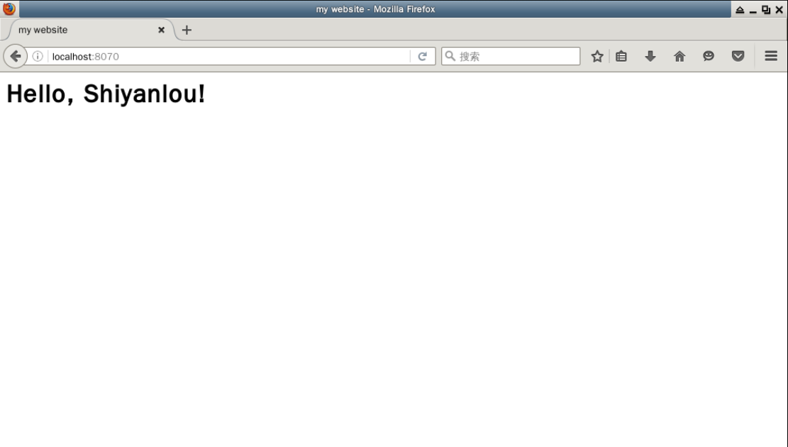

# 启动nginx
---
+ $ sudo service nginx start
+ $ sudo service nginx status
+ 查看下Nginx 版本
+ $ nginx -v
+ 查看默认配置文件
+ $ cat /etc/nginx/nginx.conf
+ grep 去除了带 # 的行和 ^$ （即空白行）
+ $ cat /etc/nginx/nginx.conf | grep -vE "#|^$"
+ 一般来说，Nginx 的配置文件的结构可以抽象成如下示意图：
+ 
+ Main 就是我们的配置文件，配置文件中的 events{...} 对应 Events，http{...} 对应 Http。
+ 在 nginx.conf 中是不是没有发现定义的 server {}？
+ 原因是：为了方便维护我们 server 相关配置，不会让某一个配置文件过于庞大。
+ 通常是将所有的虚拟主机配置文件（也就是 server 配置块的内容）存放在 /etc/nginx/conf.d/ 或者 /etc/nginx/sites-enabled/ 目录中，
+ 在主配置文件中已经默认声明了会读取这两个文件夹下所有 *.conf 文件。
---
# server 配置块
---
+ 一个典型、完整的静态 Web 服务器还会包含多个 server 配置块，例如 /etc/nginx/sites-enabled/default
+ 查看它:
+ $ cd /etc/nginx/sites-enabled/
+ $ cat ./default | grep -vE "#|^$"
+ 文件的内容及注释如下：
+ 
+ 在配置文件中可以看到，如果我们想修改 Server 的端口为 8080，那么就可以修改 listen 80 为 listen 8080。
+ 访问网站的时候应该是 网站:8080，其中 :8080 表示访问 8080 端口。
---
# location 配置块
---
+  location 用于匹配请求的 URI
+  URI 表示的是访问路径，除域名和协议以外的内容，比如说我访问了 https://www.lanqiao.cn/louplus/linux，https:// 是协议，www.lanqiao.cn 是域名，/louplus/linux 是 URI
+  location 匹配的方式有多种：
+  + 精准匹配
+  + 忽略大小写的正则匹配
+  + 大小写敏感的正则匹配
+  + 前半部分匹配
+  其语法如下：
+  
+  其中各个符号的含义：
+  + =：用于精准匹配，想请求的 URI 与 pattern 表达式完全匹配的时候才会执行 location 中的操作
+  + ~：用于区分大小写的正则匹配；
+  + ~*：用于不区分大小写的正则匹配；
+  + ^~：用于匹配 URI 的前半部分；
---
# 尝试创建虚拟服务器
---
+ 使用下面命令创建网站根目录
+ $ sudo mkdir /var/myweb/
+ 创建一个 index.html
+ $ sudo gedit /var/myweb/index.html
+ 编辑 Nginx 配置文件
+ $ cd /etc/nginx/sites-enabled/ && sudo gedit myweb.conf
+ 在重启 Nginx 使配置文件生效之前，我们还应检查一下是否有语法错误：
+ $ sudo nginx -t
+ 当看到 OK 字样后，再重新启动 Nginx
+ $ sudo service nginx restart
+ 最后，打开 Web 浏览器输入 localhost:8070 看一下结果
+ 
---